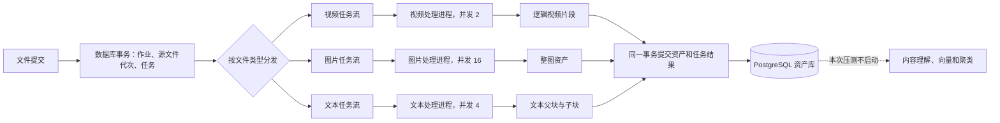

# 多模态可靠任务处理架构

## 一、建设目标

本次改造把原来只服务于视频的可靠任务机制扩展到图片和文本，使三类文件都可以先形成数据库中的
耐久任务，再由相互隔离的处理进程完成资产化。

本阶段只负责“源文件变成资产并写入数据库”。内容理解、向量生成和聚类仍是后续链路，不在本次压测中
启动。这里的关闭是运行范围控制，不是把资产标记成不可继续处理；生产编排仍可以在资产化完成后接入
后续链路。

视频继续采用逻辑分段：只保存原视频位置、片段起止时间和代表画面时间戳，不保存分段视频和关键帧文件。

## 二、总体流程

提交时先写数据库，消息队列只负责通知处理进程。即使消息发布失败，调度进程也能从数据库找到未发布或
超时任务并重新投递，因此 Redis 不是任务事实来源。

## 三、三类任务如何隔离

| 文件类型 | 任务类型 | 资源类别 | 队列路由 | 默认并发 | 资产化结果 |
|---|---|---|---|---:|---|
| 视频 | `video` | 视频加速资源 | `mps_video` | 2 | 逻辑视频片段 |
| 图片 | `image` | 通用处理器 | `cpu_image` | 16 | 一张整图资产 |
| 文本 | `text` | 通用处理器 | `cpu_text` | 4 | 父文本块与可索引子块 |

三类任务使用不同的 Redis 数据流和消费组。图片突发不会抢占视频的并发名额，长文本也不会阻塞图片处理。
任务消息必须同时匹配任务类型、资源类别、路由和处理器版本；处理进程不能通过修改消息把任务送到另一类
处理器。

为了兼容已部署的数据表，物理表名暂时仍为 `video_processing_tasks`，但表内已经保存通用任务身份。代码
和运行语义按“处理任务”理解，后续可以在独立迁移中改物理表名，不影响本次功能。

## 四、可靠性边界

### 1. 原子提交

一次提交在同一个数据库事务中完成：

1. 创建或锁定源文件；
2. 更新源文件处理代次；
3. 创建父作业；
4. 创建带受信路由的排队任务。

事务失败时四项一起回滚，不会出现有作业无任务或有任务无源文件的半成品。

### 2. 领取与租约

处理进程领取任务时，数据库更新条件同时校验：

- 任务编号；
- 源文件编号和处理代次；
- 结果版本；
- 任务类型、资源类别、路由和处理器版本；
- 当前状态和执行次数。

只有恰好更新一行才算领取成功。租约身份由已验证的任务消息、服务端处理进程编号和本次随机租约令牌
构成，不依赖数据库返回列的排列方式。这个约束来自 200 文件压测前的真实并发故障复盘。

### 3. 处理与续租

任务执行期间周期性上报真实进展并续租。处理进程退出、长时间无进展或超过硬时限后，调度进程释放旧
执行权并安排重试。旧进程即使稍后恢复，也不能用过期租约提交结果。

### 4. 结果提交

图片和文本采用整批提交，视频按逻辑片段提交。资产、源文件完成状态、任务“结果已提交”事实和父作业
计数位于同一事务中。事务只在完整租约仍有效时成功。

相同结果重复提交时返回已有资产；内容不同的重复结果会被拒绝。父作业只记账一次，消息确认发生在数据库
收口之后，因此进程在提交后、确认前退出也不会造成重复资产。

## 五、源文件与资产数据

处理进程不信任 Redis 消息中的本地文件位置。它根据消息里的源文件编号回查 PostgreSQL，校验工作区和
处理代次，再从受信目录解析源文件位置。

| 数据 | 是否长期保存 | 说明 |
|---|---|---|
| 原始图片和文本位置 | 是 | 用于重试和重新资产化 |
| 原视频位置 | 是 | 用于逻辑分段、播放和按需取帧 |
| 视频片段起止时间 | 是 | 前端播放和后续理解的定位信息 |
| 代表画面时间戳 | 是 | 后续按需取帧 |
| 分段视频文件 | 否 | 不生成 |
| 关键帧图片文件 | 否 | 临时解码到内存，用后释放 |
| 图片整图资产 | 是 | 写入资产表，不复制图片内容 |
| 文本分块 | 是 | 保存父子层级和文本内容 |

## 六、下游链路边界

本次压测有意关闭以下行为：

- 不调用内容理解模型；
- 不生成文本向量或多模态向量；
- 不写入 Milvus；
- 不创建聚类运行和聚类成员。

资产仍按正常资产规则写入。视频逻辑片段和可索引文本子块可以在后续编排中进入理解、向量和聚类。
部分文本父块及已有状态约定可能显示为“完成”，这表示该父块本身不需要被索引，不表示整个后续链路已经
执行。

## 七、视频前端兼容

视频资产必须保留三种播放方式：

| 场景 | 播放方式 |
|---|---|
| 旧版实体片段 | 直接播放已有片段文件 |
| 新版逻辑片段 | 播放原视频并限制在片段起止区间 |
| 浏览器不支持原编码 | 对当前区间实时转为兼容流，不落盘 |

接口返回明确的播放描述，前端不能通过“有没有派生文件地址”自行猜测模式。逻辑片段没有关键帧文件时显示
占位封面，播放时仍使用原视频区间。

## 八、当前接入方式

当前已经提供三类可独立部署的运行单元：

- 文件提交服务：识别图片或文本并创建耐久任务；
- 图片、文本处理进程：各自只消费一种受信路由；
- 图片、文本恢复调度进程：补发未发布消息、回收超时任务并驱动重试。

命令行入口为 `submit-processing-task`、`cpu-task-worker` 和 `cpu-task-scheduler`。视频继续使用原有视频任务
提交、处理和调度入口。

单进程启动接口服务时，默认由接口进程托管图片、文本的处理进程池和恢复调度器，启动就绪后才对外服务；
任一组件异常退出会被监督器记录并退避重建，健康检查会展示每条路由的就绪、运行、重启次数和最近错误。
视频仍由独立的 MPS 处理进程执行。生产环境若使用独立图片、文本进程，必须设置
`CAPSULE_API_EMBEDDED_CPU_TASKS_ENABLED=false`，避免接口副本数放大实际并发。

浏览器文件夹导入已经改为“一个上传作业下挂多个耐久任务”。完整文件清单在一个数据库事务中准备，图片、
文本和视频任务都指向原浏览器作业，前端的总数、完成数和失败数继续表示文件数。初次 Redis 发布失败时
不把作业标记失败，三路调度进程会根据数据库任务补发。

浏览器点击完成后，请求会先计算源文件指纹，再由一个数据库事务同时完成作业启动、完整任务批次建立和
分发登记，成功后才返回。计算指纹期间作业仍处于可重试状态；事务失败不会留下部分任务；事务成功后即使
接口进程立即退出，数据库任务也能被调度进程恢复，Redis 不承担持久化事实来源。

未配置模型服务时，最后一个文件资产化完成后作业直接结束。配置模型服务时，作业先停在“资产已保存”，
常驻工作流协调器使用 PostgreSQL 租约领取后续处理，从该作业的成功任务重新枚举当前代次资产，再执行
理解、向量和增量聚类；接口进程重启后可以重新领取，不依赖内存队列。

图片资产进入内容理解模型前统一转换为 768×768 的 JPEG：原图按比例缩放后居中留白，不裁剪原始内容，
也不修改源文件。该规则只作用于内容理解输入，原生多模态向量仍使用原图片准备策略。三个语义维度各自
保持最多 5 条事实；结构校验失败时，修复提示从当前 Schema 动态取得字段数量和字段名，不再维护容易漂移
的硬编码列表。

最后一个任务完成父作业计数时，资产枚举同时接纳“结果已提交”和“已完成确认”两种状态，避免确认消息
尚未结束时漏掉最后一批资产。后续处理开始前必须完成首次租约续期，执行期间与心跳失效竞速；一旦失去
租约立即取消旧实例的处理。协调器单轮数据库异常会记录并退避重试，不会让常驻循环静默退出。

## 九、主要实现位置

| 内容 | 文件 |
|---|---|
| 通用任务身份与租约 | `src/capsule/pipeline/video_task_runtime.py` |
| PostgreSQL 任务仓储 | `src/capsule/db/video_tasks.py` |
| 图片、文本任务提交 | `src/capsule/pipeline/processing_task_service.py` |
| 图片、文本处理器 | `src/capsule/pipeline/processing_task_processor.py` |
| 处理器注册表 | `src/capsule/pipeline/processing_task_registry.py` |
| 图片、文本原子资产提交 | `src/capsule/db/processing_task_persistence.py` |
| 数据库迁移 | `migrations/versions/20260812_0013_processing_task_identity.py` |
| 混合压测 | `scripts/benchmark_mixed_durable_tasks.py` |

## 十、上线要求

1. 先执行数据库迁移；
2. 为图片和文本分别启动恢复调度进程；
3. 图片、文本处理进程按独立并发配置部署；
4. MPS 视频处理进程仍运行在 macOS 宿主机；
5. 源文件目录必须位于受信目录中，并在任务重试期间保持可访问；
6. 监控排队、处理中、等待重试、死信、租约超时和各路由积压；
7. 浏览器入口必须保持一个上传作业挂多个耐久任务，并监控资产化与后续工作流两层租约。
