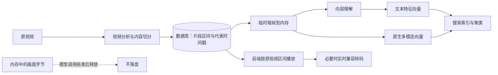
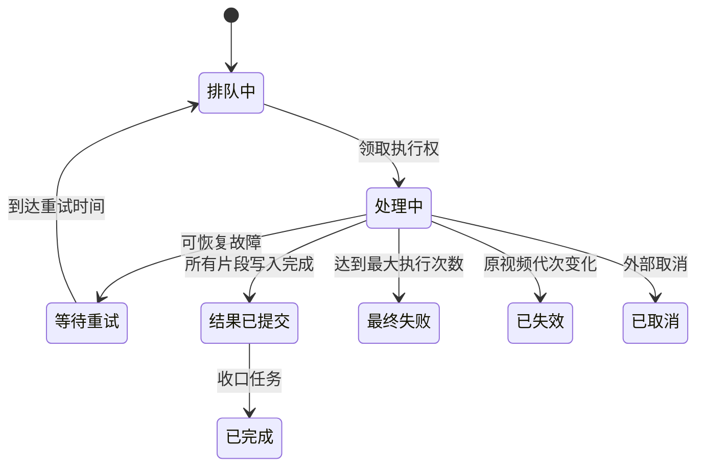

# 可靠视频任务与无派生文件方案

## 一、方案结论

视频仍然是完整的生产资产，必须正常入库，并继续经过内容理解、向量化、搜索索引和聚类。

本方案只取消三类派生媒体文件的持久化：

- 不保存切分后的视频文件；
- 不保存预览或兼容播放副本；
- 不保存关键帧图片。

数据库继续保存原视频位置、每个片段的起止时间、代表画面的时间戳、理解结果、特征、向量记录和聚类
结果。模型需要画面时，按代表画面时间戳从原视频临时解码到内存；模型调用结束后释放，不写入本地
目录，也不上传对象存储。

多视频性能测试可以只运行“分析、切分、临时取帧”部分，不入库、不运行向量和聚类。这只是为了测量
视频处理速度，不能改变生产流程。

## 二、总体流程

生产链路按以下顺序运行：

1. 校验原视频位置是否位于受信目录；
2. 读取视频时长、尺寸、帧率和编码信息；
3. 低帧率顺序解码分析画面，计算画面质量、变化程度和视觉特征；
4. 根据内容变化形成片段，并选择每段一至三个代表画面时间戳；
5. 将片段资产写入数据库，初始处理状态为“等待处理”；
6. 内容理解和原生多模态向量按时间戳从原视频临时取帧；
7. 保存理解结果和各类向量，并执行搜索索引与增量聚类；
8. 前端播放时读取原视频，只暴露当前片段的相对进度；
9. 浏览器不支持原视频编码时，实时转为兼容视频流，仍不生成本地文件。

## 三、保存与不保存的数据

### 必须长期保存

| 数据 | 保存位置 | 用途 |
|---|---|---|
| 原视频位置和摘要 | 数据库 | 播放、临时取帧、变更检测 |
| 片段起止时间 | 数据库 | 片段定位和区间播放 |
| 代表画面时间戳与质量指标 | 数据库 | 内容理解和原生多模态向量输入 |
| 资产状态 | 数据库 | 驱动等待处理、处理中、完成或失败状态 |
| 名称、描述和特征 | 数据库 | 检索、展示和文本向量化 |
| 向量记录 | 数据库与向量库 | 搜索召回和聚类 |
| 聚类结果 | 数据库 | 资产组织和前端展示 |

### 不得长期保存

| 数据 | 处理方式 |
|---|---|
| 切分后的视频 | 只记录原视频中的起止位置 |
| 预览视频 | 前端直接读取原视频区间 |
| 关键帧图片 | 需要时临时解码到内存，用完释放 |
| 浏览器兼容副本 | 通过进程标准输出实时返回，不创建文件 |
| 分析阶段的原始画面和视觉特征 | 每批计算完成后及时释放 |

## 四、片段资产的数据约定

新片段通过 `file_info.video_output_mode=logical` 明确标记为“无派生文件模式”。不能只根据是否存在
起止时间判断，因为旧的实体片段也保存原视频区间。

| 字段 | 规则 |
|---|---|
| `source_locator.type` | 固定为 `time_range` |
| `source_locator.start_ms` | 原视频中的片段起点，非负整数 |
| `source_locator.end_ms` | 原视频中的片段终点，必须大于起点 |
| `source_locator.segment_index` | 同一视频中从零开始连续编号 |
| `file_info.video_output_mode` | 固定为 `logical` |
| `file_info.representative_frames` | 只保存时间戳和质量指标，不保存图片地址 |
| `derived_file_uri` | 为空 |
| `preview_uri` | 为空 |
| 临时关键帧内容 | 入库前清空 |
| `processing_status` | 入库时为 `pending`，随后正常转为 `processing` 和 `completed` |

处理指纹包含输出模式。切换无派生文件模式和旧实体模式时，不会错误复用另一种模式的历史结果。

## 五、模型如何读取视频画面

### 内容理解

内容理解最多选择三个代表时间戳。每个时间戳启动一次受并发限制的取帧操作，图片经标准输出直接读入
内存，并以图片数据地址传给模型。取帧失败时，该资产记录理解错误，不会伪造描述。

### 原生多模态向量

原生多模态向量使用同一组代表时间戳，并把临时图片作为多图输入。输入摘要由向量类型、来源模式和
实际图片字节共同计算，因此重复运行可以正确复用已经建立的向量，也能在画面变化时重新计算。

### 文本特征向量与聚类

内容理解完成后，资产描述和各个特征继续生成独立文本向量。原生多模态向量和文本特征向量随后进入
搜索索引与增量聚类。无派生文件模式不会再被资产查询、向量查询或聚类查询排除。

内存取帧器具有以下保护：

- 只读取受信的本地原视频位置；
- 并发量受视频解码配置限制；
- 单次操作有超时；
- 取消或超时时回收整个子进程组；
- 输出必须是有效的 JPEG 字节；
- 不传入任何输出文件路径。

## 六、两种视频写入入口

### 浏览器和同步导入

切分完成后，一次写入当前原视频代次的全部片段。写入结果会返回可处理的资产编号，并立即提交给统一
的后续处理编排：原生多模态向量与内容理解并行，理解完成后生成文本特征向量，最后运行增量聚类。

### 耐久视频任务

耗时较长的视频由独立工作进程处理。数据库是任务状态的唯一事实来源，消息队列只负责投递。每个片段
写入时都会同时校验任务、执行轮次、工作进程、原视频代次、租约和结果版本，过期工作进程不能提交旧
结果。

耐久任务写出的片段同样是正常的待处理资产，不使用“跳过”状态，也不会被理解、向量和聚类查询排除。
视频切分性能测试若关闭后续处理，必须作为测试参数或测试编排处理，不能修改资产的生产数据约定。

## 七、任务可靠性

典型故障处理如下：

| 故障 | 恢复方式 |
|---|---|
| 创建任务失败 | 作业、原视频代次和任务在同一事务回滚 |
| 首次发布消息失败 | 调度进程根据数据库记录补发 |
| 工作进程退出 | 租约到期后释放执行权并安排重试 |
| 长时间没有真实进展 | 终止视频解码进程组并重试或最终失败 |
| 结果已提交但消息未确认 | 重投后只收尾，不重复写入结果 |
| 最终失败但死信未发布 | 调度进程根据数据库事实补发死信 |

## 八、前端播放兼容

资产接口返回统一的播放描述：

| 播放模式 | 适用资产 | 前端行为 |
|---|---|---|
| `derived_clip` | 旧实体片段 | 播放已有的独立视频文件 |
| `source_range` | 新逻辑片段 | 读取原视频，跳到片段起点，以片段时长显示相对进度，到终点暂停 |
| `transcoded_stream` | 浏览器不支持的本地原视频 | 实时返回 H.264 分片视频流，从零播放当前片段 |

播放接口支持单段字节范围请求，并返回正确的范围、长度、媒体类型和跨域响应头。逻辑片段没有封面时，
接口返回空缩略图地址，前端显示占位内容，不请求不存在的文件。

对于本地 ProRes、Matroska 等浏览器不兼容来源，兼容转码具有以下约束：

- 只处理当前片段区间；
- macOS 优先使用硬件 H.264 编码，其他平台使用可用的软件编码；
- 像素格式为 `yuv420p`，音轨存在时转为 AAC；
- 结果通过标准输出直接连接到网络响应；
- 不创建临时文件，也不缓存兼容副本；
- 浏览器断开后立即回收转码进程组。

旧实体片段继续保持兼容，不迁移、不删除已有视频和关键帧文件。

## 九、原视频位置与安全边界

无派生文件方案依赖原视频长期存在。允许读取的本地来源只有：

- 浏览器导入目录 `CAPSULE_IMPORT_ROOT`；
- 显式配置的额外视频目录 `CAPSULE_VIDEO_SOURCE_ROOTS`。

不要把整个下载目录、用户主目录或磁盘根目录加入允许列表，应使用专门的视频素材目录。移动、改名或
删除原视频后，对应片段将无法播放和重新取帧，这是只记录位置方案的固有限制。

## 十、主要配置

| 配置项 | 作用 |
|---|---|
| `CAPSULE_VIDEO_OUTPUT_MODE` | `logical` 为默认无派生文件模式，`materialized` 为旧实体模式 |
| `CAPSULE_VIDEO_SOURCE_ROOTS` | 允许长期引用的额外视频目录 |
| `CAPSULE_FFMPEG_CONCURRENCY` | 视频分析和临时取帧的并发上限 |
| `CAPSULE_VIDEO_TRANSCODE_CONCURRENCY` | 每个接口进程允许同时运行的兼容转码数量 |
| `CAPSULE_VIDEO_TASK_LEASE_SECONDS` | 视频任务执行权租约时间 |
| `CAPSULE_VIDEO_TASK_PROGRESS_TIMEOUT_SECONDS` | 无真实进展超时 |
| `CAPSULE_VIDEO_TASK_HARD_TIMEOUT_SECONDS` | 单轮最长执行时间 |
| `CAPSULE_VIDEO_TASK_MAX_ATTEMPTS` | 最大执行次数 |

## 十一、主要代码位置

| 内容 | 文件 |
|---|---|
| 输出模式和片段标记 | `src/capsule/video_output.py` |
| 视频分析与内存释放 | `src/capsule/parsers/video.py` |
| 临时代表画面提取 | `src/capsule/media/video_frames.py` |
| 同步入库与后续分发 | `src/capsule/pipeline/runner.py` |
| 内容理解 | `src/capsule/pipeline/understanding.py` |
| 向量化 | `src/capsule/pipeline/embedding.py` |
| 统一后续处理编排 | `src/capsule/pipeline/import_service.py` |
| 耐久视频处理 | `src/capsule/pipeline/video_task_processor.py` |
| 播放与实时兼容转码 | `src/capsule/api/assets.py` |
| 前端区间播放器 | `frontend/app/components/SegmentVideoPlayer.tsx` |

## 十二、验收重点

验收必须区分“视频处理性能测试”和“生产完整链路测试”。

性能测试关注：

- 多个真实视频能完成分析和切分；
- 不生成片段视频、预览和关键帧文件；
- 临时画面在使用后释放；
- 记录总耗时、模型冷启动耗时、热态耗时、片段数和代表时间戳数。

生产链路测试关注：

- 逻辑片段以 `pending` 状态入库；
- 入库结果会触发后续处理；
- 内容理解能从原视频临时取帧；
- 原生多模态向量使用临时图片输入；
- 文本特征向量、搜索索引和增量聚类仍会运行；
- 前端同时兼容旧实体片段和新逻辑片段；
- 整个过程不创建新的派生媒体文件。

2026-08-11 的视频切分性能测试使用 6 个样本，共得到 32 个逻辑片段和 48 个代表画面时间戳，总耗时
19.301 秒；没有生成新的片段视频或关键帧文件。这个结果只代表视频分析与切分性能，不代表完整模型
链路耗时。

当前限制：对象存储中的浏览器不兼容原视频暂不做无落盘兼容转码；本地实时转码没有缓存；逻辑片段
依赖原视频位置长期有效；语音识别仍不在本阶段范围内。
